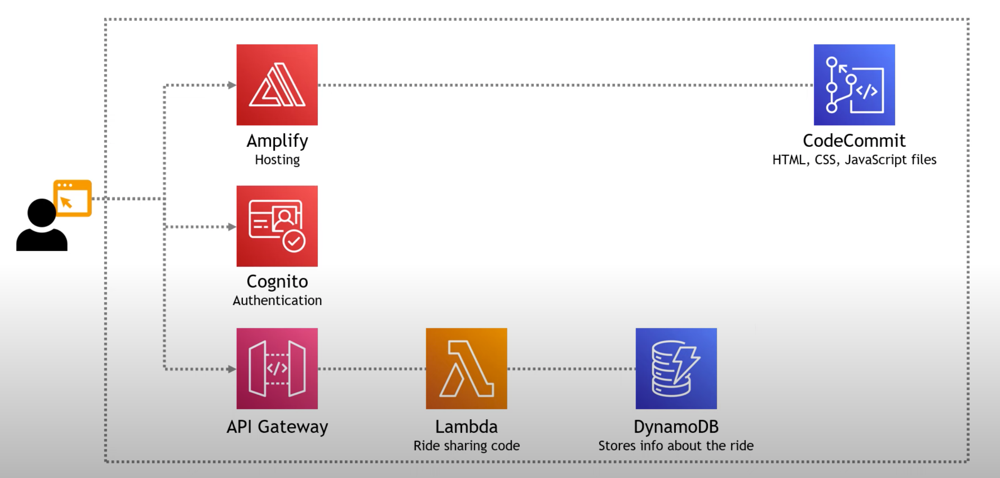

# Build-a-Serverless-Website-on-AWS

## Project Overview
This project involves building a Serverless Web Application on AWS using the management console. Utilising serverless AWS services such as Amplify, API Gateway, Lambbda, etc.
URL to my project: ([Cristina Gonzalez Marrero - Serverless Website on AWS](https://master.d2xmc84da8ysbr.amplifyapp.com/))

## Architecture
- **CodeCommit**: Securely store and manage, i.e a way to store/update/pull code from Git repositories.
- **IAM User**: Control access to AWS services with customisable permissions, i.e handling permissions for code.
- **Amplify**: This is where we host the website and make updates.
- **Cognito**: Manage user authentication and authorization easily.
- **Lambda**: Run code in response to events without managing servers, in this case, a way to do ride sharing functionality.
- **DynamoDB**: Fast, scalable NoSQL database for low-latency access. Used for storing/returning ride results.
- **API Gateway**: Create, publish, and secure APIs at any scale. Used as a way to invoke ride sharing functionality.

## Reference Diagram

## Contributors

- [Cristina Gonzalez Marrero](https://github.com/cristicristi7)
- AWS Documentation in here [AWS Documentation](https://aws.amazon.com/getting-started/hands-on/build-serverless-web-app-lambda-apigateway-s3-dynamodb-cognito/)
- Tiny Tech Tutorials on Youtube

## Note

The request unicorn feature has limited functionality due to licensing changes with ArcGIS.
